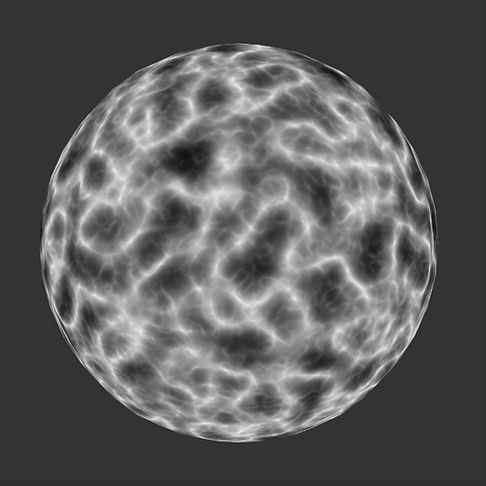

# GPU-GEMS-Improved-Perlin-Noise

This project is a port of the GPU gems article on improved perlin noise to Unity. The GPU gems article describes a method that is more optimal for the GPU than implementations that have been written for the CPU. The article describes how to implement 3D and 4D noise. It also describes some extra optimization techniques that can be applied to the 3D noise by pre-processing some data and packing it into a texture. The code for this is given in the book but they have left out the optimizing for the 4D noise. Ive managed to work it out though. I'm not sure its as they intended but it dramatically reduce the number of texture looks ups so I'm happy with that. Ive also added the code for the 2D noise. This could be worked out quite easily by removing the third dimension from the 3D noise and adding the appropriate gradients.

As the code has been optimized for the GPU performance is excellent. I achieved frame rates of about 200 for the 4D noise which is quite impressive considering the amount of work that needs to be done. I did attempt to use the same method for generating the 2D noise on the CPU but surprisingly it was slower that the original implementation. This is probably due to the fact that the GPU version has been optimized by use of texture look ups and vector operations which are much slower on the CPU.

List of procedural noise projects

[Procedural Noise](https://github.com/Scrawk/Procedural-Noise)\
[GPU-Voronoi-Noise](https://github.com/Scrawk/GPU-Voronoi-Noise)\
[GPU-GEMS-Improved-Perlin-Noise](https://github.com/Scrawk/GPU-GEMS-Improved-Perlin-Noise)
